# David Haase (NYC-MHTN-DS-042219)
#### Project 1: King County Housing Data Analysis 
#### Task:
* Clean, explore, and model this dataset with a multivariate linear regression to predict the sale price of houses as accurately as possible. 

#### Result:


## [code] Import Standard Libraries


```python
# import libraries
import pandas as pd
import numpy as np
import math as mt
import matplotlib.pyplot as plt
import seaborn as sns
%matplotlib inline
import statsmodels.api as sm
import statsmodels.formula.api as smf
import scipy.stats as stats
from sklearn.linear_model import LinearRegression
from sklearn.model_selection import train_test_split
from sklearn.metrics import mean_squared_error
```

## [code] Define Utility Functions


```python
def get_data(data_file):
    try:
        data = pd.read_csv(data_file)
    except Exception as e:
        print(e) 
    return data

def get_model(data, target):
    X = data.drop(target, axis=1)
    y = data[target]
    X_int = sm.add_constant(X)
    return sm.OLS(y,X_int).fit()

def show_predictions(feature):
    

    f = 'price~'+ feature
    feat_model = smf.ols(formula=f, data=df).fit()
    feat_model.summary()

    # create a DataFrame with the minimum and maximum values of TV
    X_new = pd.DataFrame({feature: [df_final[feature].min(), df_final[feature].max()]})
    print(X_new.head())

    # make predictions for those x values and store them
    preds = feat_model.predict(X_new)
    print (preds)

    # first, plot the observed data and the least squares line
    df_final.plot(kind='scatter', x=feature, y='price')
    plt.plot(X_new, preds, c='red', linewidth=2)
    plt.show()

    fig = plt.figure(figsize=(15,8))
    fig = sm.graphics.plot_regress_exog(feat_model, feature, fig=fig)
    plt.show()
# 
    
def train_and_check_error(X, y, test_size):
    X_train, X_test, y_train, y_test = train_test_split(X, y, test_size = test_size)
    print(len(X_train), len(X_test), len(y_train), len(y_test))
    linreg = LinearRegression()
    linreg.fit(X_train, y_train)

    y_hat_train = linreg.predict(X_train)
    y_hat_test = linreg.predict(X_test)
    train_residuals = y_hat_train - y_train
    test_residuals = y_hat_test - y_test

    mse_train = np.sum((y_train-y_hat_train)**2)/len(y_train)
    mse_test =np.sum((y_test-y_hat_test)**2)/len(y_test)
    print('Train Mean Squared Error:', mse_train)
    print('Test Mean Squared Error:', mse_test)
    train_mse = mean_squared_error(y_train, y_hat_train)
    test_mse = mean_squared_error(y_test, y_hat_test)
    print('Train Mean Squared Error:', train_mse)
    print('Test Mean Squared Error:', test_mse)
```

## [code] Main program begins here
* Define your project variables
* Set up your sample and population data


```python
data_file = 'kc_house_data.csv'
sample_percent = 0.8

raw = get_data(data_file)
```


```python
raw.shape
```


    (21597, 21)


```python
raw.info()
```

    <class 'pandas.core.frame.DataFrame'>
    RangeIndex: 21597 entries, 0 to 21596
    Data columns (total 21 columns):
    id               21597 non-null int64
    date             21597 non-null object
    price            21597 non-null float64
    bedrooms         21597 non-null int64
    bathrooms        21597 non-null float64
    sqft_living      21597 non-null int64
    sqft_lot         21597 non-null int64
    floors           21597 non-null float64
    waterfront       19221 non-null float64
    view             21534 non-null float64
    condition        21597 non-null int64
    grade            21597 non-null int64
    sqft_above       21597 non-null int64
    sqft_basement    21597 non-null object
    yr_built         21597 non-null int64
    yr_renovated     17755 non-null float64
    zipcode          21597 non-null int64
    lat              21597 non-null float64
    long             21597 non-null float64
    sqft_living15    21597 non-null int64
    sqft_lot15       21597 non-null int64
    dtypes: float64(8), int64(11), object(2)
    memory usage: 3.5+ MB


```python
raw.describe()
```


<div>
<style scoped>
    .dataframe tbody tr th:only-of-type {
        vertical-align: middle;
    }

    .dataframe tbody tr th {
        vertical-align: top;
    }

    .dataframe thead th {
        text-align: right;
    }
</style>
<table border="1" class="dataframe">
  <thead>
    <tr style="text-align: right;">
      <th></th>
      <th>id</th>
      <th>price</th>
      <th>bedrooms</th>
      <th>bathrooms</th>
      <th>sqft_living</th>
      <th>sqft_lot</th>
      <th>floors</th>
      <th>waterfront</th>
      <th>view</th>
      <th>condition</th>
      <th>grade</th>
      <th>sqft_above</th>
      <th>yr_built</th>
      <th>yr_renovated</th>
      <th>zipcode</th>
      <th>lat</th>
      <th>long</th>
      <th>sqft_living15</th>
      <th>sqft_lot15</th>
    </tr>
  </thead>
  <tbody>
    <tr>
      <th>count</th>
      <td>2.159700e+04</td>
      <td>2.159700e+04</td>
      <td>21597.000000</td>
      <td>21597.000000</td>
      <td>21597.000000</td>
      <td>2.159700e+04</td>
      <td>21597.000000</td>
      <td>19221.000000</td>
      <td>21534.000000</td>
      <td>21597.000000</td>
      <td>21597.000000</td>
      <td>21597.000000</td>
      <td>21597.000000</td>
      <td>17755.000000</td>
      <td>21597.000000</td>
      <td>21597.000000</td>
      <td>21597.000000</td>
      <td>21597.000000</td>
      <td>21597.000000</td>
    </tr>
    <tr>
      <th>mean</th>
      <td>4.580474e+09</td>
      <td>5.402966e+05</td>
      <td>3.373200</td>
      <td>2.115826</td>
      <td>2080.321850</td>
      <td>1.509941e+04</td>
      <td>1.494096</td>
      <td>0.007596</td>
      <td>0.233863</td>
      <td>3.409825</td>
      <td>7.657915</td>
      <td>1788.596842</td>
      <td>1970.999676</td>
      <td>83.636778</td>
      <td>98077.951845</td>
      <td>47.560093</td>
      <td>-122.213982</td>
      <td>1986.620318</td>
      <td>12758.283512</td>
    </tr>
    <tr>
      <th>std</th>
      <td>2.876736e+09</td>
      <td>3.673681e+05</td>
      <td>0.926299</td>
      <td>0.768984</td>
      <td>918.106125</td>
      <td>4.141264e+04</td>
      <td>0.539683</td>
      <td>0.086825</td>
      <td>0.765686</td>
      <td>0.650546</td>
      <td>1.173200</td>
      <td>827.759761</td>
      <td>29.375234</td>
      <td>399.946414</td>
      <td>53.513072</td>
      <td>0.138552</td>
      <td>0.140724</td>
      <td>685.230472</td>
      <td>27274.441950</td>
    </tr>
    <tr>
      <th>min</th>
      <td>1.000102e+06</td>
      <td>7.800000e+04</td>
      <td>1.000000</td>
      <td>0.500000</td>
      <td>370.000000</td>
      <td>5.200000e+02</td>
      <td>1.000000</td>
      <td>0.000000</td>
      <td>0.000000</td>
      <td>1.000000</td>
      <td>3.000000</td>
      <td>370.000000</td>
      <td>1900.000000</td>
      <td>0.000000</td>
      <td>98001.000000</td>
      <td>47.155900</td>
      <td>-122.519000</td>
      <td>399.000000</td>
      <td>651.000000</td>
    </tr>
    <tr>
      <th>25%</th>
      <td>2.123049e+09</td>
      <td>3.220000e+05</td>
      <td>3.000000</td>
      <td>1.750000</td>
      <td>1430.000000</td>
      <td>5.040000e+03</td>
      <td>1.000000</td>
      <td>0.000000</td>
      <td>0.000000</td>
      <td>3.000000</td>
      <td>7.000000</td>
      <td>1190.000000</td>
      <td>1951.000000</td>
      <td>0.000000</td>
      <td>98033.000000</td>
      <td>47.471100</td>
      <td>-122.328000</td>
      <td>1490.000000</td>
      <td>5100.000000</td>
    </tr>
    <tr>
      <th>50%</th>
      <td>3.904930e+09</td>
      <td>4.500000e+05</td>
      <td>3.000000</td>
      <td>2.250000</td>
      <td>1910.000000</td>
      <td>7.618000e+03</td>
      <td>1.500000</td>
      <td>0.000000</td>
      <td>0.000000</td>
      <td>3.000000</td>
      <td>7.000000</td>
      <td>1560.000000</td>
      <td>1975.000000</td>
      <td>0.000000</td>
      <td>98065.000000</td>
      <td>47.571800</td>
      <td>-122.231000</td>
      <td>1840.000000</td>
      <td>7620.000000</td>
    </tr>
    <tr>
      <th>75%</th>
      <td>7.308900e+09</td>
      <td>6.450000e+05</td>
      <td>4.000000</td>
      <td>2.500000</td>
      <td>2550.000000</td>
      <td>1.068500e+04</td>
      <td>2.000000</td>
      <td>0.000000</td>
      <td>0.000000</td>
      <td>4.000000</td>
      <td>8.000000</td>
      <td>2210.000000</td>
      <td>1997.000000</td>
      <td>0.000000</td>
      <td>98118.000000</td>
      <td>47.678000</td>
      <td>-122.125000</td>
      <td>2360.000000</td>
      <td>10083.000000</td>
    </tr>
    <tr>
      <th>max</th>
      <td>9.900000e+09</td>
      <td>7.700000e+06</td>
      <td>33.000000</td>
      <td>8.000000</td>
      <td>13540.000000</td>
      <td>1.651359e+06</td>
      <td>3.500000</td>
      <td>1.000000</td>
      <td>4.000000</td>
      <td>5.000000</td>
      <td>13.000000</td>
      <td>9410.000000</td>
      <td>2015.000000</td>
      <td>2015.000000</td>
      <td>98199.000000</td>
      <td>47.777600</td>
      <td>-121.315000</td>
      <td>6210.000000</td>
      <td>871200.000000</td>
    </tr>
  </tbody>
</table>
</div>


```python
raw.isna().sum()
```


    id                  0
    date                0
    price               0
    bedrooms            0
    bathrooms           0
    sqft_living         0
    sqft_lot            0
    floors              0
    waterfront       2376
    view               63
    condition           0
    grade               0
    sqft_above          0
    sqft_basement       0
    yr_built            0
    yr_renovated     3842
    zipcode             0
    lat                 0
    long                0
    sqft_living15       0
    sqft_lot15          0
    dtype: int64


## Start the first round of testing
* Run a test on dirty data


```python
# Get rid of the id column (domain knowledge)
df = raw.drop('id', axis=1)
```

As expected, the OLS crashes on dirty, raw data.


```python
model = get_model(df, 'price')
model.summary()
```


    ---------------------------------------------------------------------------

    ValueError                                Traceback (most recent call last)

    <ipython-input-9-2b0f2231d16e> in <module>()
    ----> 1 model = get_model(df, 'price')
          2 model.summary()


    <ipython-input-2-026fe695b312> in get_model(data, target)
         10     y = data[target]
         11     X_int = sm.add_constant(X)
    ---> 12     return sm.OLS(y,X_int).fit()
         13 
         14 def show_predictions(feature):


    ~/anaconda3/envs/learn-env/lib/python3.6/site-packages/statsmodels/regression/linear_model.py in __init__(self, endog, exog, missing, hasconst, **kwargs)
        815                  **kwargs):
        816         super(OLS, self).__init__(endog, exog, missing=missing,
    --> 817                                   hasconst=hasconst, **kwargs)
        818         if "weights" in self._init_keys:
        819             self._init_keys.remove("weights")


    ~/anaconda3/envs/learn-env/lib/python3.6/site-packages/statsmodels/regression/linear_model.py in __init__(self, endog, exog, weights, missing, hasconst, **kwargs)
        661             weights = weights.squeeze()
        662         super(WLS, self).__init__(endog, exog, missing=missing,
    --> 663                                   weights=weights, hasconst=hasconst, **kwargs)
        664         nobs = self.exog.shape[0]
        665         weights = self.weights


    ~/anaconda3/envs/learn-env/lib/python3.6/site-packages/statsmodels/regression/linear_model.py in __init__(self, endog, exog, **kwargs)
        177     """
        178     def __init__(self, endog, exog, **kwargs):
    --> 179         super(RegressionModel, self).__init__(endog, exog, **kwargs)
        180         self._data_attr.extend(['pinv_wexog', 'wendog', 'wexog', 'weights'])
        181 


    ~/anaconda3/envs/learn-env/lib/python3.6/site-packages/statsmodels/base/model.py in __init__(self, endog, exog, **kwargs)
        210 
        211     def __init__(self, endog, exog=None, **kwargs):
    --> 212         super(LikelihoodModel, self).__init__(endog, exog, **kwargs)
        213         self.initialize()
        214 


    ~/anaconda3/envs/learn-env/lib/python3.6/site-packages/statsmodels/base/model.py in __init__(self, endog, exog, **kwargs)
         62         hasconst = kwargs.pop('hasconst', None)
         63         self.data = self._handle_data(endog, exog, missing, hasconst,
    ---> 64                                       **kwargs)
         65         self.k_constant = self.data.k_constant
         66         self.exog = self.data.exog


    ~/anaconda3/envs/learn-env/lib/python3.6/site-packages/statsmodels/base/model.py in _handle_data(self, endog, exog, missing, hasconst, **kwargs)
         85 
         86     def _handle_data(self, endog, exog, missing, hasconst, **kwargs):
    ---> 87         data = handle_data(endog, exog, missing, hasconst, **kwargs)
         88         # kwargs arrays could have changed, easier to just attach here
         89         for key in kwargs:


    ~/anaconda3/envs/learn-env/lib/python3.6/site-packages/statsmodels/base/data.py in handle_data(endog, exog, missing, hasconst, **kwargs)
        631     klass = handle_data_class_factory(endog, exog)
        632     return klass(endog, exog=exog, missing=missing, hasconst=hasconst,
    --> 633                  **kwargs)
    

    ~/anaconda3/envs/learn-env/lib/python3.6/site-packages/statsmodels/base/data.py in __init__(self, endog, exog, missing, hasconst, **kwargs)
         74             self.orig_endog = endog
         75             self.orig_exog = exog
    ---> 76             self.endog, self.exog = self._convert_endog_exog(endog, exog)
         77 
         78         # this has side-effects, attaches k_constant and const_idx


    ~/anaconda3/envs/learn-env/lib/python3.6/site-packages/statsmodels/base/data.py in _convert_endog_exog(self, endog, exog)
        472         exog = exog if exog is None else np.asarray(exog)
        473         if endog.dtype == object or exog is not None and exog.dtype == object:
    --> 474             raise ValueError("Pandas data cast to numpy dtype of object. "
        475                              "Check input data with np.asarray(data).")
        476         return super(PandasData, self)._convert_endog_exog(endog, exog)


    ValueError: Pandas data cast to numpy dtype of object. Check input data with np.asarray(data).


### Start cleaning up: NaNs, placeholders, continuous and categoric transformations
#### id, date and engineered date features


```python
# Convert the date STR to date DATE
df.date = pd.to_datetime(df.date, format='%m/%d/%Y')

# Engineer new features: Day of the week, Month, Age
df['Dayofweek'] = df.date.dt.dayofweek
df['Month'] = df.date.dt.month
df['Age'] = df.date.dt.year - df.yr_built

# So, get rid of the original columns
df.drop(['date', 'yr_built'], axis=1, inplace=True)
```

#### yr_renovated
* Strange to have floats
* 17.8% = NaNs (n=3842)
* 78.8% = 0.0 (n=17,011), presumably never remodeled


```python
df['yr_renovated'].isna().sum()
df['yr_renovated'].value_counts()

# Convert to binary category: Renovated?  
# Deal with NaNs 

# For now, remove
df.drop('yr_renovated', axis=1, inplace=True)
```

#### sqft_basement
* Simply conversion to int() fails, why?
* 2.1% = '?', n=454
* 61.5% '0.0' or '0.00' n=13,280; presumably this means no basement
#### Decision
* Convert to category: _Has Basement?_ and split the '?' evenly
* Deleting feature for now


```python
# Converting sqft_basement to int() fails, why?
df['sqft_basement'].value_counts()

#For now, drop it
df.drop('sqft_basement', axis=1, inplace=True)
```


```python
df.head()
```


<div>
<style scoped>
    .dataframe tbody tr th:only-of-type {
        vertical-align: middle;
    }

    .dataframe tbody tr th {
        vertical-align: top;
    }

    .dataframe thead th {
        text-align: right;
    }
</style>
<table border="1" class="dataframe">
  <thead>
    <tr style="text-align: right;">
      <th></th>
      <th>price</th>
      <th>bedrooms</th>
      <th>bathrooms</th>
      <th>sqft_living</th>
      <th>sqft_lot</th>
      <th>floors</th>
      <th>waterfront</th>
      <th>view</th>
      <th>condition</th>
      <th>grade</th>
      <th>sqft_above</th>
      <th>zipcode</th>
      <th>lat</th>
      <th>long</th>
      <th>sqft_living15</th>
      <th>sqft_lot15</th>
      <th>Dayofweek</th>
      <th>Month</th>
      <th>Age</th>
    </tr>
  </thead>
  <tbody>
    <tr>
      <th>0</th>
      <td>221900.0</td>
      <td>3</td>
      <td>1.00</td>
      <td>1180</td>
      <td>5650</td>
      <td>1.0</td>
      <td>NaN</td>
      <td>0.0</td>
      <td>3</td>
      <td>7</td>
      <td>1180</td>
      <td>98178</td>
      <td>47.5112</td>
      <td>-122.257</td>
      <td>1340</td>
      <td>5650</td>
      <td>0</td>
      <td>10</td>
      <td>59</td>
    </tr>
    <tr>
      <th>1</th>
      <td>538000.0</td>
      <td>3</td>
      <td>2.25</td>
      <td>2570</td>
      <td>7242</td>
      <td>2.0</td>
      <td>0.0</td>
      <td>0.0</td>
      <td>3</td>
      <td>7</td>
      <td>2170</td>
      <td>98125</td>
      <td>47.7210</td>
      <td>-122.319</td>
      <td>1690</td>
      <td>7639</td>
      <td>1</td>
      <td>12</td>
      <td>63</td>
    </tr>
    <tr>
      <th>2</th>
      <td>180000.0</td>
      <td>2</td>
      <td>1.00</td>
      <td>770</td>
      <td>10000</td>
      <td>1.0</td>
      <td>0.0</td>
      <td>0.0</td>
      <td>3</td>
      <td>6</td>
      <td>770</td>
      <td>98028</td>
      <td>47.7379</td>
      <td>-122.233</td>
      <td>2720</td>
      <td>8062</td>
      <td>2</td>
      <td>2</td>
      <td>82</td>
    </tr>
    <tr>
      <th>3</th>
      <td>604000.0</td>
      <td>4</td>
      <td>3.00</td>
      <td>1960</td>
      <td>5000</td>
      <td>1.0</td>
      <td>0.0</td>
      <td>0.0</td>
      <td>5</td>
      <td>7</td>
      <td>1050</td>
      <td>98136</td>
      <td>47.5208</td>
      <td>-122.393</td>
      <td>1360</td>
      <td>5000</td>
      <td>1</td>
      <td>12</td>
      <td>49</td>
    </tr>
    <tr>
      <th>4</th>
      <td>510000.0</td>
      <td>3</td>
      <td>2.00</td>
      <td>1680</td>
      <td>8080</td>
      <td>1.0</td>
      <td>0.0</td>
      <td>0.0</td>
      <td>3</td>
      <td>8</td>
      <td>1680</td>
      <td>98074</td>
      <td>47.6168</td>
      <td>-122.045</td>
      <td>1800</td>
      <td>7503</td>
      <td>2</td>
      <td>2</td>
      <td>28</td>
    </tr>
  </tbody>
</table>
</div>


#### view
* Value counts look clean
* < 0.3% = NaN, n=63 counts
#### Decision
* Let's just convert those to the median which is: 0.00


```python
df['view'].value_counts()
df['view'] = df['view'].fillna(value=df['view'].median())
df.view.value_counts()
```


    0.0    19485
    2.0      957
    3.0      508
    1.0      330
    4.0      317
    Name: view, dtype: int64


#### waterfront
* 11.0% = NaN, n=2,376
* Value Counts are binary, 1 (n=146) or 0 (n=19,075)
* 0.8% probability that it is waterfront
#### Decision
* Convert NaNs to higher probability: 0
* Convert to category with dummy variables


```python
# Fill the NaNs with the higher probable value
df.waterfront.value_counts()
df['waterfront'] = df['waterfront'].fillna(value=0)

# Converting to categories
wtf_dummies = pd.get_dummies(df['waterfront'], prefix="wtf_")
df = pd.concat([df, wtf_dummies], axis=1)

# Now drop the column
df.drop('waterfront', axis=1, inplace = True)
df.head()
```


<div>
<style scoped>
    .dataframe tbody tr th:only-of-type {
        vertical-align: middle;
    }

    .dataframe tbody tr th {
        vertical-align: top;
    }

    .dataframe thead th {
        text-align: right;
    }
</style>
<table border="1" class="dataframe">
  <thead>
    <tr style="text-align: right;">
      <th></th>
      <th>price</th>
      <th>bedrooms</th>
      <th>bathrooms</th>
      <th>sqft_living</th>
      <th>sqft_lot</th>
      <th>floors</th>
      <th>view</th>
      <th>condition</th>
      <th>grade</th>
      <th>sqft_above</th>
      <th>zipcode</th>
      <th>lat</th>
      <th>long</th>
      <th>sqft_living15</th>
      <th>sqft_lot15</th>
      <th>Dayofweek</th>
      <th>Month</th>
      <th>Age</th>
      <th>wtf__0.0</th>
      <th>wtf__1.0</th>
    </tr>
  </thead>
  <tbody>
    <tr>
      <th>0</th>
      <td>221900.0</td>
      <td>3</td>
      <td>1.00</td>
      <td>1180</td>
      <td>5650</td>
      <td>1.0</td>
      <td>0.0</td>
      <td>3</td>
      <td>7</td>
      <td>1180</td>
      <td>98178</td>
      <td>47.5112</td>
      <td>-122.257</td>
      <td>1340</td>
      <td>5650</td>
      <td>0</td>
      <td>10</td>
      <td>59</td>
      <td>1</td>
      <td>0</td>
    </tr>
    <tr>
      <th>1</th>
      <td>538000.0</td>
      <td>3</td>
      <td>2.25</td>
      <td>2570</td>
      <td>7242</td>
      <td>2.0</td>
      <td>0.0</td>
      <td>3</td>
      <td>7</td>
      <td>2170</td>
      <td>98125</td>
      <td>47.7210</td>
      <td>-122.319</td>
      <td>1690</td>
      <td>7639</td>
      <td>1</td>
      <td>12</td>
      <td>63</td>
      <td>1</td>
      <td>0</td>
    </tr>
    <tr>
      <th>2</th>
      <td>180000.0</td>
      <td>2</td>
      <td>1.00</td>
      <td>770</td>
      <td>10000</td>
      <td>1.0</td>
      <td>0.0</td>
      <td>3</td>
      <td>6</td>
      <td>770</td>
      <td>98028</td>
      <td>47.7379</td>
      <td>-122.233</td>
      <td>2720</td>
      <td>8062</td>
      <td>2</td>
      <td>2</td>
      <td>82</td>
      <td>1</td>
      <td>0</td>
    </tr>
    <tr>
      <th>3</th>
      <td>604000.0</td>
      <td>4</td>
      <td>3.00</td>
      <td>1960</td>
      <td>5000</td>
      <td>1.0</td>
      <td>0.0</td>
      <td>5</td>
      <td>7</td>
      <td>1050</td>
      <td>98136</td>
      <td>47.5208</td>
      <td>-122.393</td>
      <td>1360</td>
      <td>5000</td>
      <td>1</td>
      <td>12</td>
      <td>49</td>
      <td>1</td>
      <td>0</td>
    </tr>
    <tr>
      <th>4</th>
      <td>510000.0</td>
      <td>3</td>
      <td>2.00</td>
      <td>1680</td>
      <td>8080</td>
      <td>1.0</td>
      <td>0.0</td>
      <td>3</td>
      <td>8</td>
      <td>1680</td>
      <td>98074</td>
      <td>47.6168</td>
      <td>-122.045</td>
      <td>1800</td>
      <td>7503</td>
      <td>2</td>
      <td>2</td>
      <td>28</td>
      <td>1</td>
      <td>0</td>
    </tr>
  </tbody>
</table>
</div>


#### And so on...
* Here I ran out of time, but further tests might help
* But I least OLS doesn't crash


```python
# Fill the NaNs with the higher probable value
df.zipcode.value_counts()
df.condition.value_counts()
df.grade.value_counts()
df.view.value_counts()
```


    0.0    19485
    2.0      957
    3.0      508
    1.0      330
    4.0      317
    Name: view, dtype: int64


## [code] Start Modeling
#### But OLS no longer crashes, so begin modeling


```python
model = get_model(df, 'price')
model.summary()
```


<table class="simpletable">
<caption>OLS Regression Results</caption>
<tr>
  <th>Dep. Variable:</th>          <td>price</td>      <th>  R-squared:         </th>  <td>   0.700</td>  
</tr>
<tr>
  <th>Model:</th>                   <td>OLS</td>       <th>  Adj. R-squared:    </th>  <td>   0.700</td>  
</tr>
<tr>
  <th>Method:</th>             <td>Least Squares</td>  <th>  F-statistic:       </th>  <td>   2801.</td>  
</tr>
<tr>
  <th>Date:</th>             <td>Wed, 08 May 2019</td> <th>  Prob (F-statistic):</th>   <td>  0.00</td>   
</tr>
<tr>
  <th>Time:</th>                 <td>13:39:50</td>     <th>  Log-Likelihood:    </th> <td>-2.9438e+05</td>
</tr>
<tr>
  <th>No. Observations:</th>      <td> 21597</td>      <th>  AIC:               </th>  <td>5.888e+05</td> 
</tr>
<tr>
  <th>Df Residuals:</th>          <td> 21578</td>      <th>  BIC:               </th>  <td>5.889e+05</td> 
</tr>
<tr>
  <th>Df Model:</th>              <td>    18</td>      <th>                     </th>      <td> </td>     
</tr>
<tr>
  <th>Covariance Type:</th>      <td>nonrobust</td>    <th>                     </th>      <td> </td>     
</tr>
</table>
<table class="simpletable">
<tr>
        <td></td>           <th>coef</th>     <th>std err</th>      <th>t</th>      <th>P>|t|</th>  <th>[0.025</th>    <th>0.975]</th>  
</tr>
<tr>
  <th>const</th>         <td> 1.715e+06</td> <td> 1.92e+06</td> <td>    0.893</td> <td> 0.372</td> <td>-2.05e+06</td> <td> 5.48e+06</td>
</tr>
<tr>
  <th>bedrooms</th>      <td>-3.641e+04</td> <td> 1899.303</td> <td>  -19.168</td> <td> 0.000</td> <td>-4.01e+04</td> <td>-3.27e+04</td>
</tr>
<tr>
  <th>bathrooms</th>     <td> 4.395e+04</td> <td> 3238.434</td> <td>   13.570</td> <td> 0.000</td> <td> 3.76e+04</td> <td> 5.03e+04</td>
</tr>
<tr>
  <th>sqft_living</th>   <td>  149.9602</td> <td>    4.394</td> <td>   34.128</td> <td> 0.000</td> <td>  141.348</td> <td>  158.573</td>
</tr>
<tr>
  <th>sqft_lot</th>      <td>    0.1232</td> <td>    0.048</td> <td>    2.572</td> <td> 0.010</td> <td>    0.029</td> <td>    0.217</td>
</tr>
<tr>
  <th>floors</th>        <td> 8434.7541</td> <td> 3596.560</td> <td>    2.345</td> <td> 0.019</td> <td> 1385.231</td> <td> 1.55e+04</td>
</tr>
<tr>
  <th>view</th>          <td>  5.34e+04</td> <td> 2120.868</td> <td>   25.179</td> <td> 0.000</td> <td> 4.92e+04</td> <td> 5.76e+04</td>
</tr>
<tr>
  <th>condition</th>     <td> 2.499e+04</td> <td> 2317.454</td> <td>   10.785</td> <td> 0.000</td> <td> 2.05e+04</td> <td> 2.95e+04</td>
</tr>
<tr>
  <th>grade</th>         <td> 9.737e+04</td> <td> 2158.617</td> <td>   45.109</td> <td> 0.000</td> <td> 9.31e+04</td> <td> 1.02e+05</td>
</tr>
<tr>
  <th>sqft_above</th>    <td>   31.0407</td> <td>    4.358</td> <td>    7.123</td> <td> 0.000</td> <td>   22.500</td> <td>   39.582</td>
</tr>
<tr>
  <th>zipcode</th>       <td> -590.5704</td> <td>   32.976</td> <td>  -17.909</td> <td> 0.000</td> <td> -655.206</td> <td> -525.935</td>
</tr>
<tr>
  <th>lat</th>           <td> 5.994e+05</td> <td> 1.07e+04</td> <td>   55.869</td> <td> 0.000</td> <td> 5.78e+05</td> <td>  6.2e+05</td>
</tr>
<tr>
  <th>long</th>          <td>-2.157e+05</td> <td> 1.31e+04</td> <td>  -16.408</td> <td> 0.000</td> <td>-2.41e+05</td> <td> -1.9e+05</td>
</tr>
<tr>
  <th>sqft_living15</th> <td>   20.6537</td> <td>    3.446</td> <td>    5.994</td> <td> 0.000</td> <td>   13.900</td> <td>   27.408</td>
</tr>
<tr>
  <th>sqft_lot15</th>    <td>   -0.3814</td> <td>    0.073</td> <td>   -5.202</td> <td> 0.000</td> <td>   -0.525</td> <td>   -0.238</td>
</tr>
<tr>
  <th>Dayofweek</th>     <td> -148.4187</td> <td>  938.730</td> <td>   -0.158</td> <td> 0.874</td> <td>-1988.398</td> <td> 1691.561</td>
</tr>
<tr>
  <th>Month</th>         <td>-2738.0249</td> <td>  440.443</td> <td>   -6.217</td> <td> 0.000</td> <td>-3601.325</td> <td>-1874.725</td>
</tr>
<tr>
  <th>Age</th>           <td> 2768.2196</td> <td>   68.896</td> <td>   40.180</td> <td> 0.000</td> <td> 2633.179</td> <td> 2903.260</td>
</tr>
<tr>
  <th>wtf__0.0</th>      <td> 5.452e+05</td> <td>  9.6e+05</td> <td>    0.568</td> <td> 0.570</td> <td>-1.34e+06</td> <td> 2.43e+06</td>
</tr>
<tr>
  <th>wtf__1.0</th>      <td> 1.169e+06</td> <td>  9.6e+05</td> <td>    1.219</td> <td> 0.223</td> <td>-7.12e+05</td> <td> 3.05e+06</td>
</tr>
</table>
<table class="simpletable">
<tr>
  <th>Omnibus:</th>       <td>18408.354</td> <th>  Durbin-Watson:     </th>  <td>   1.988</td>  
</tr>
<tr>
  <th>Prob(Omnibus):</th>  <td> 0.000</td>   <th>  Jarque-Bera (JB):  </th> <td>1869064.744</td>
</tr>
<tr>
  <th>Skew:</th>           <td> 3.579</td>   <th>  Prob(JB):          </th>  <td>    0.00</td>  
</tr>
<tr>
  <th>Kurtosis:</th>       <td>48.009</td>   <th>  Cond. No.          </th>  <td>3.63e+20</td>  
</tr>
</table><br/><br/>Warnings:<br/>[1] Standard Errors assume that the covariance matrix of the errors is correctly specified.<br/>[2] The smallest eigenvalue is 1.66e-27. This might indicate that there are<br/>strong multicollinearity problems or that the design matrix is singular.


### How is it?
* P-value is way too high despite a nice R-Squared value
* Warnings indicate collinearity

## Next Step
### Which features are most highly correlated?


```python
df.corr().sort_values(by=['price'], ascending=False)
```


<div>
<style scoped>
    .dataframe tbody tr th:only-of-type {
        vertical-align: middle;
    }

    .dataframe tbody tr th {
        vertical-align: top;
    }

    .dataframe thead th {
        text-align: right;
    }
</style>
<table border="1" class="dataframe">
  <thead>
    <tr style="text-align: right;">
      <th></th>
      <th>price</th>
      <th>bedrooms</th>
      <th>bathrooms</th>
      <th>sqft_living</th>
      <th>sqft_lot</th>
      <th>floors</th>
      <th>view</th>
      <th>condition</th>
      <th>grade</th>
      <th>sqft_above</th>
      <th>zipcode</th>
      <th>lat</th>
      <th>long</th>
      <th>sqft_living15</th>
      <th>sqft_lot15</th>
      <th>Dayofweek</th>
      <th>Month</th>
      <th>Age</th>
      <th>wtf__0.0</th>
      <th>wtf__1.0</th>
    </tr>
  </thead>
  <tbody>
    <tr>
      <th>price</th>
      <td>1.000000</td>
      <td>0.308787</td>
      <td>0.525906</td>
      <td>0.701917</td>
      <td>0.089876</td>
      <td>0.256804</td>
      <td>0.393497</td>
      <td>0.036056</td>
      <td>0.667951</td>
      <td>0.605368</td>
      <td>-0.053402</td>
      <td>0.306692</td>
      <td>0.022036</td>
      <td>0.585241</td>
      <td>0.082845</td>
      <td>-0.001747</td>
      <td>-0.009928</td>
      <td>-0.053890</td>
      <td>-0.264306</td>
      <td>0.264306</td>
    </tr>
    <tr>
      <th>sqft_living</th>
      <td>0.701917</td>
      <td>0.578212</td>
      <td>0.755758</td>
      <td>1.000000</td>
      <td>0.173453</td>
      <td>0.353953</td>
      <td>0.281715</td>
      <td>-0.059445</td>
      <td>0.762779</td>
      <td>0.876448</td>
      <td>-0.199802</td>
      <td>0.052155</td>
      <td>0.241214</td>
      <td>0.756402</td>
      <td>0.184342</td>
      <td>0.005260</td>
      <td>0.012112</td>
      <td>-0.318592</td>
      <td>-0.104637</td>
      <td>0.104637</td>
    </tr>
    <tr>
      <th>grade</th>
      <td>0.667951</td>
      <td>0.356563</td>
      <td>0.665838</td>
      <td>0.762779</td>
      <td>0.114731</td>
      <td>0.458794</td>
      <td>0.249082</td>
      <td>-0.146896</td>
      <td>1.000000</td>
      <td>0.756073</td>
      <td>-0.185771</td>
      <td>0.113575</td>
      <td>0.200341</td>
      <td>0.713867</td>
      <td>0.120981</td>
      <td>0.002406</td>
      <td>0.008989</td>
      <td>-0.448322</td>
      <td>-0.082818</td>
      <td>0.082818</td>
    </tr>
    <tr>
      <th>sqft_above</th>
      <td>0.605368</td>
      <td>0.479386</td>
      <td>0.686668</td>
      <td>0.876448</td>
      <td>0.184139</td>
      <td>0.523989</td>
      <td>0.166017</td>
      <td>-0.158904</td>
      <td>0.756073</td>
      <td>1.000000</td>
      <td>-0.261570</td>
      <td>-0.001199</td>
      <td>0.344842</td>
      <td>0.731767</td>
      <td>0.195077</td>
      <td>0.006223</td>
      <td>0.010153</td>
      <td>-0.424386</td>
      <td>-0.071778</td>
      <td>0.071778</td>
    </tr>
    <tr>
      <th>sqft_living15</th>
      <td>0.585241</td>
      <td>0.393406</td>
      <td>0.569884</td>
      <td>0.756402</td>
      <td>0.144763</td>
      <td>0.280102</td>
      <td>0.278928</td>
      <td>-0.093072</td>
      <td>0.713867</td>
      <td>0.731767</td>
      <td>-0.279299</td>
      <td>0.048679</td>
      <td>0.335626</td>
      <td>1.000000</td>
      <td>0.183515</td>
      <td>0.004308</td>
      <td>0.002513</td>
      <td>-0.326697</td>
      <td>-0.083823</td>
      <td>0.083823</td>
    </tr>
    <tr>
      <th>bathrooms</th>
      <td>0.525906</td>
      <td>0.514508</td>
      <td>1.000000</td>
      <td>0.755758</td>
      <td>0.088373</td>
      <td>0.502582</td>
      <td>0.186016</td>
      <td>-0.126479</td>
      <td>0.665838</td>
      <td>0.686668</td>
      <td>-0.204786</td>
      <td>0.024280</td>
      <td>0.224903</td>
      <td>0.569884</td>
      <td>0.088303</td>
      <td>0.010466</td>
      <td>0.007543</td>
      <td>-0.507561</td>
      <td>-0.063629</td>
      <td>0.063629</td>
    </tr>
    <tr>
      <th>view</th>
      <td>0.393497</td>
      <td>0.078354</td>
      <td>0.186016</td>
      <td>0.281715</td>
      <td>0.075054</td>
      <td>0.028414</td>
      <td>1.000000</td>
      <td>0.045622</td>
      <td>0.249082</td>
      <td>0.166017</td>
      <td>0.085059</td>
      <td>0.006321</td>
      <td>-0.077702</td>
      <td>0.278928</td>
      <td>0.073083</td>
      <td>0.006858</td>
      <td>-0.005161</td>
      <td>0.054467</td>
      <td>-0.380543</td>
      <td>0.380543</td>
    </tr>
    <tr>
      <th>bedrooms</th>
      <td>0.308787</td>
      <td>1.000000</td>
      <td>0.514508</td>
      <td>0.578212</td>
      <td>0.032471</td>
      <td>0.177944</td>
      <td>0.078354</td>
      <td>0.026496</td>
      <td>0.356563</td>
      <td>0.479386</td>
      <td>-0.154092</td>
      <td>-0.009951</td>
      <td>0.132054</td>
      <td>0.393406</td>
      <td>0.030690</td>
      <td>0.009673</td>
      <td>-0.001046</td>
      <td>-0.155817</td>
      <td>0.002127</td>
      <td>-0.002127</td>
    </tr>
    <tr>
      <th>lat</th>
      <td>0.306692</td>
      <td>-0.009951</td>
      <td>0.024280</td>
      <td>0.052155</td>
      <td>-0.085514</td>
      <td>0.049239</td>
      <td>0.006321</td>
      <td>-0.015102</td>
      <td>0.113575</td>
      <td>-0.001199</td>
      <td>0.266742</td>
      <td>1.000000</td>
      <td>-0.135371</td>
      <td>0.048679</td>
      <td>-0.086139</td>
      <td>-0.016476</td>
      <td>0.014995</td>
      <td>0.147898</td>
      <td>0.012157</td>
      <td>-0.012157</td>
    </tr>
    <tr>
      <th>wtf__1.0</th>
      <td>0.264306</td>
      <td>-0.002127</td>
      <td>0.063629</td>
      <td>0.104637</td>
      <td>0.021459</td>
      <td>0.020797</td>
      <td>0.380543</td>
      <td>0.016648</td>
      <td>0.082818</td>
      <td>0.071778</td>
      <td>0.028923</td>
      <td>-0.012157</td>
      <td>-0.037628</td>
      <td>0.083823</td>
      <td>0.030658</td>
      <td>-0.005641</td>
      <td>0.008199</td>
      <td>0.024406</td>
      <td>-1.000000</td>
      <td>1.000000</td>
    </tr>
    <tr>
      <th>floors</th>
      <td>0.256804</td>
      <td>0.177944</td>
      <td>0.502582</td>
      <td>0.353953</td>
      <td>-0.004814</td>
      <td>1.000000</td>
      <td>0.028414</td>
      <td>-0.264075</td>
      <td>0.458794</td>
      <td>0.523989</td>
      <td>-0.059541</td>
      <td>0.049239</td>
      <td>0.125943</td>
      <td>0.280102</td>
      <td>-0.010722</td>
      <td>0.002431</td>
      <td>0.014245</td>
      <td>-0.489514</td>
      <td>-0.020797</td>
      <td>0.020797</td>
    </tr>
    <tr>
      <th>sqft_lot</th>
      <td>0.089876</td>
      <td>0.032471</td>
      <td>0.088373</td>
      <td>0.173453</td>
      <td>1.000000</td>
      <td>-0.004814</td>
      <td>0.075054</td>
      <td>-0.008830</td>
      <td>0.114731</td>
      <td>0.184139</td>
      <td>-0.129586</td>
      <td>-0.085514</td>
      <td>0.230227</td>
      <td>0.144763</td>
      <td>0.718204</td>
      <td>-0.002748</td>
      <td>-0.002591</td>
      <td>-0.052853</td>
      <td>-0.021459</td>
      <td>0.021459</td>
    </tr>
    <tr>
      <th>sqft_lot15</th>
      <td>0.082845</td>
      <td>0.030690</td>
      <td>0.088303</td>
      <td>0.184342</td>
      <td>0.718204</td>
      <td>-0.010722</td>
      <td>0.073083</td>
      <td>-0.003126</td>
      <td>0.120981</td>
      <td>0.195077</td>
      <td>-0.147294</td>
      <td>-0.086139</td>
      <td>0.255586</td>
      <td>0.183515</td>
      <td>1.000000</td>
      <td>0.004130</td>
      <td>0.003189</td>
      <td>-0.070770</td>
      <td>-0.030658</td>
      <td>0.030658</td>
    </tr>
    <tr>
      <th>condition</th>
      <td>0.036056</td>
      <td>0.026496</td>
      <td>-0.126479</td>
      <td>-0.059445</td>
      <td>-0.008830</td>
      <td>-0.264075</td>
      <td>0.045622</td>
      <td>1.000000</td>
      <td>-0.146896</td>
      <td>-0.158904</td>
      <td>0.002888</td>
      <td>-0.015102</td>
      <td>-0.105877</td>
      <td>-0.093072</td>
      <td>-0.003126</td>
      <td>0.007216</td>
      <td>0.022388</td>
      <td>0.360836</td>
      <td>-0.016648</td>
      <td>0.016648</td>
    </tr>
    <tr>
      <th>long</th>
      <td>0.022036</td>
      <td>0.132054</td>
      <td>0.224903</td>
      <td>0.241214</td>
      <td>0.230227</td>
      <td>0.125943</td>
      <td>-0.077702</td>
      <td>-0.105877</td>
      <td>0.200341</td>
      <td>0.344842</td>
      <td>-0.564259</td>
      <td>-0.135371</td>
      <td>1.000000</td>
      <td>0.335626</td>
      <td>0.255586</td>
      <td>0.004054</td>
      <td>-0.008404</td>
      <td>-0.409959</td>
      <td>0.037628</td>
      <td>-0.037628</td>
    </tr>
    <tr>
      <th>Dayofweek</th>
      <td>-0.001747</td>
      <td>0.009673</td>
      <td>0.010466</td>
      <td>0.005260</td>
      <td>-0.002748</td>
      <td>0.002431</td>
      <td>0.006858</td>
      <td>0.007216</td>
      <td>0.002406</td>
      <td>0.006223</td>
      <td>0.003190</td>
      <td>-0.016476</td>
      <td>0.004054</td>
      <td>0.004308</td>
      <td>0.004130</td>
      <td>1.000000</td>
      <td>-0.047850</td>
      <td>-0.006781</td>
      <td>0.005641</td>
      <td>-0.005641</td>
    </tr>
    <tr>
      <th>Month</th>
      <td>-0.009928</td>
      <td>-0.001046</td>
      <td>0.007543</td>
      <td>0.012112</td>
      <td>-0.002591</td>
      <td>0.014245</td>
      <td>-0.005161</td>
      <td>0.022388</td>
      <td>0.008989</td>
      <td>0.010153</td>
      <td>-0.000143</td>
      <td>0.014995</td>
      <td>-0.008404</td>
      <td>0.002513</td>
      <td>0.003189</td>
      <td>-0.047850</td>
      <td>1.000000</td>
      <td>-0.006218</td>
      <td>-0.008199</td>
      <td>0.008199</td>
    </tr>
    <tr>
      <th>zipcode</th>
      <td>-0.053402</td>
      <td>-0.154092</td>
      <td>-0.204786</td>
      <td>-0.199802</td>
      <td>-0.129586</td>
      <td>-0.059541</td>
      <td>0.085059</td>
      <td>0.002888</td>
      <td>-0.185771</td>
      <td>-0.261570</td>
      <td>1.000000</td>
      <td>0.266742</td>
      <td>-0.564259</td>
      <td>-0.279299</td>
      <td>-0.147294</td>
      <td>0.003190</td>
      <td>-0.000143</td>
      <td>0.347206</td>
      <td>-0.028923</td>
      <td>0.028923</td>
    </tr>
    <tr>
      <th>Age</th>
      <td>-0.053890</td>
      <td>-0.155817</td>
      <td>-0.507561</td>
      <td>-0.318592</td>
      <td>-0.052853</td>
      <td>-0.489514</td>
      <td>0.054467</td>
      <td>0.360836</td>
      <td>-0.448322</td>
      <td>-0.424386</td>
      <td>0.347206</td>
      <td>0.147898</td>
      <td>-0.409959</td>
      <td>-0.326697</td>
      <td>-0.070770</td>
      <td>-0.006781</td>
      <td>-0.006218</td>
      <td>1.000000</td>
      <td>-0.024406</td>
      <td>0.024406</td>
    </tr>
    <tr>
      <th>wtf__0.0</th>
      <td>-0.264306</td>
      <td>0.002127</td>
      <td>-0.063629</td>
      <td>-0.104637</td>
      <td>-0.021459</td>
      <td>-0.020797</td>
      <td>-0.380543</td>
      <td>-0.016648</td>
      <td>-0.082818</td>
      <td>-0.071778</td>
      <td>-0.028923</td>
      <td>0.012157</td>
      <td>0.037628</td>
      <td>-0.083823</td>
      <td>-0.030658</td>
      <td>0.005641</td>
      <td>-0.008199</td>
      <td>-0.024406</td>
      <td>1.000000</td>
      <td>-1.000000</td>
    </tr>
  </tbody>
</table>
</div>


### Just to visualize and experiment with Sam Bell's masking code


```python
correlation = df.corr()
plt.figure(figsize=(14,12))
mask=np.zeros_like(df.corr(), dtype=np.bool)
mask[np.triu_indices_from(mask)] = True
heatmap = sns.heatmap(correlation, annot=True, mask=mask,
                     linewidths=0, vmin=-1, cmap="coolwarm")
```


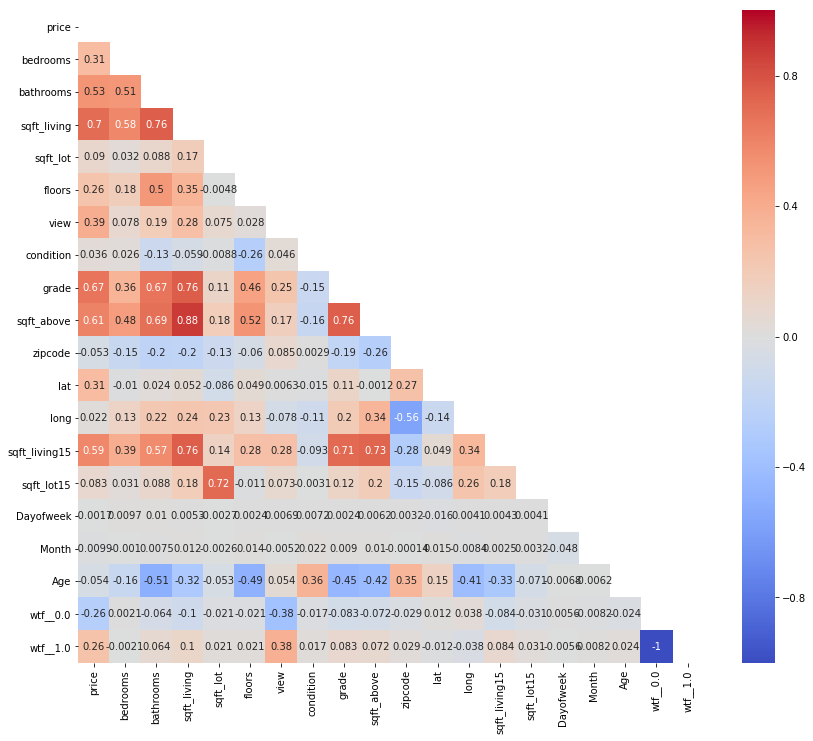


### Dropping everything but the top eight


```python
df_final_colums = ['price','sqft_living', 'grade','sqft_above','sqft_living15','bathrooms','view','bedrooms','lat']
df_final = pd.DataFrame(df[df_final_colums])
model = get_model(df_final,'price')
model.summary()
```


<table class="simpletable">
<caption>OLS Regression Results</caption>
<tr>
  <th>Dep. Variable:</th>          <td>price</td>      <th>  R-squared:         </th>  <td>   0.639</td>  
</tr>
<tr>
  <th>Model:</th>                   <td>OLS</td>       <th>  Adj. R-squared:    </th>  <td>   0.639</td>  
</tr>
<tr>
  <th>Method:</th>             <td>Least Squares</td>  <th>  F-statistic:       </th>  <td>   4783.</td>  
</tr>
<tr>
  <th>Date:</th>             <td>Wed, 08 May 2019</td> <th>  Prob (F-statistic):</th>   <td>  0.00</td>   
</tr>
<tr>
  <th>Time:</th>                 <td>13:39:52</td>     <th>  Log-Likelihood:    </th> <td>-2.9638e+05</td>
</tr>
<tr>
  <th>No. Observations:</th>      <td> 21597</td>      <th>  AIC:               </th>  <td>5.928e+05</td> 
</tr>
<tr>
  <th>Df Residuals:</th>          <td> 21588</td>      <th>  BIC:               </th>  <td>5.928e+05</td> 
</tr>
<tr>
  <th>Df Model:</th>              <td>     8</td>      <th>                     </th>      <td> </td>     
</tr>
<tr>
  <th>Covariance Type:</th>      <td>nonrobust</td>    <th>                     </th>      <td> </td>     
</tr>
</table>
<table class="simpletable">
<tr>
        <td></td>           <th>coef</th>     <th>std err</th>      <th>t</th>      <th>P>|t|</th>  <th>[0.025</th>    <th>0.975]</th>  
</tr>
<tr>
  <th>const</th>         <td>-3.181e+07</td> <td> 5.24e+05</td> <td>  -60.678</td> <td> 0.000</td> <td>-3.28e+07</td> <td>-3.08e+07</td>
</tr>
<tr>
  <th>sqft_living</th>   <td>  208.7275</td> <td>    4.368</td> <td>   47.781</td> <td> 0.000</td> <td>  200.165</td> <td>  217.290</td>
</tr>
<tr>
  <th>grade</th>         <td> 7.874e+04</td> <td> 2260.281</td> <td>   34.837</td> <td> 0.000</td> <td> 7.43e+04</td> <td> 8.32e+04</td>
</tr>
<tr>
  <th>sqft_above</th>    <td>  -11.8291</td> <td>    4.106</td> <td>   -2.881</td> <td> 0.004</td> <td>  -19.878</td> <td>   -3.780</td>
</tr>
<tr>
  <th>sqft_living15</th> <td>    4.2253</td> <td>    3.614</td> <td>    1.169</td> <td> 0.242</td> <td>   -2.859</td> <td>   11.310</td>
</tr>
<tr>
  <th>bathrooms</th>     <td>-1.317e+04</td> <td> 3118.563</td> <td>   -4.222</td> <td> 0.000</td> <td>-1.93e+04</td> <td>-7055.295</td>
</tr>
<tr>
  <th>view</th>          <td> 9.382e+04</td> <td> 2122.629</td> <td>   44.200</td> <td> 0.000</td> <td> 8.97e+04</td> <td>  9.8e+04</td>
</tr>
<tr>
  <th>bedrooms</th>      <td>-2.834e+04</td> <td> 2060.725</td> <td>  -13.752</td> <td> 0.000</td> <td>-3.24e+04</td> <td>-2.43e+04</td>
</tr>
<tr>
  <th>lat</th>           <td> 6.608e+05</td> <td> 1.11e+04</td> <td>   59.771</td> <td> 0.000</td> <td> 6.39e+05</td> <td> 6.83e+05</td>
</tr>
</table>
<table class="simpletable">
<tr>
  <th>Omnibus:</th>       <td>18870.324</td> <th>  Durbin-Watson:     </th>  <td>   1.993</td>  
</tr>
<tr>
  <th>Prob(Omnibus):</th>  <td> 0.000</td>   <th>  Jarque-Bera (JB):  </th> <td>1749172.499</td>
</tr>
<tr>
  <th>Skew:</th>           <td> 3.768</td>   <th>  Prob(JB):          </th>  <td>    0.00</td>  
</tr>
<tr>
  <th>Kurtosis:</th>       <td>46.440</td>   <th>  Cond. No.          </th>  <td>1.27e+06</td>  
</tr>
</table><br/><br/>Warnings:<br/>[1] Standard Errors assume that the covariance matrix of the errors is correctly specified.<br/>[2] The condition number is large, 1.27e+06. This might indicate that there are<br/>strong multicollinearity or other numerical problems.


### How is it now?
#### Two features still have evelated P-values, removing:
* sqft_above
* sqft_living15


```python
df_final_colums = ['price','sqft_living', 'grade','bathrooms','view','bedrooms','lat']
df_final = pd.DataFrame(df[df_final_colums])
model = get_model(df_final,'price')
model.summary()
```


<table class="simpletable">
<caption>OLS Regression Results</caption>
<tr>
  <th>Dep. Variable:</th>          <td>price</td>      <th>  R-squared:         </th>  <td>   0.639</td>  
</tr>
<tr>
  <th>Model:</th>                   <td>OLS</td>       <th>  Adj. R-squared:    </th>  <td>   0.639</td>  
</tr>
<tr>
  <th>Method:</th>             <td>Least Squares</td>  <th>  F-statistic:       </th>  <td>   6374.</td>  
</tr>
<tr>
  <th>Date:</th>             <td>Wed, 08 May 2019</td> <th>  Prob (F-statistic):</th>   <td>  0.00</td>   
</tr>
<tr>
  <th>Time:</th>                 <td>13:39:53</td>     <th>  Log-Likelihood:    </th> <td>-2.9638e+05</td>
</tr>
<tr>
  <th>No. Observations:</th>      <td> 21597</td>      <th>  AIC:               </th>  <td>5.928e+05</td> 
</tr>
<tr>
  <th>Df Residuals:</th>          <td> 21590</td>      <th>  BIC:               </th>  <td>5.928e+05</td> 
</tr>
<tr>
  <th>Df Model:</th>              <td>     6</td>      <th>                     </th>      <td> </td>     
</tr>
<tr>
  <th>Covariance Type:</th>      <td>nonrobust</td>    <th>                     </th>      <td> </td>     
</tr>
</table>
<table class="simpletable">
<tr>
       <td></td>          <th>coef</th>     <th>std err</th>      <th>t</th>      <th>P>|t|</th>  <th>[0.025</th>    <th>0.975]</th>  
</tr>
<tr>
  <th>const</th>       <td>-3.201e+07</td> <td> 5.19e+05</td> <td>  -61.631</td> <td> 0.000</td> <td> -3.3e+07</td> <td> -3.1e+07</td>
</tr>
<tr>
  <th>sqft_living</th> <td>  202.4241</td> <td>    3.245</td> <td>   62.372</td> <td> 0.000</td> <td>  196.063</td> <td>  208.785</td>
</tr>
<tr>
  <th>grade</th>       <td> 7.773e+04</td> <td> 2082.099</td> <td>   37.333</td> <td> 0.000</td> <td> 7.37e+04</td> <td> 8.18e+04</td>
</tr>
<tr>
  <th>bathrooms</th>   <td>-1.353e+04</td> <td> 3110.258</td> <td>   -4.350</td> <td> 0.000</td> <td>-1.96e+04</td> <td>-7431.881</td>
</tr>
<tr>
  <th>view</th>        <td>  9.53e+04</td> <td> 2062.438</td> <td>   46.209</td> <td> 0.000</td> <td> 9.13e+04</td> <td> 9.93e+04</td>
</tr>
<tr>
  <th>bedrooms</th>    <td>-2.804e+04</td> <td> 2058.083</td> <td>  -13.627</td> <td> 0.000</td> <td>-3.21e+04</td> <td> -2.4e+04</td>
</tr>
<tr>
  <th>lat</th>         <td> 6.651e+05</td> <td> 1.09e+04</td> <td>   60.773</td> <td> 0.000</td> <td> 6.44e+05</td> <td> 6.87e+05</td>
</tr>
</table>
<table class="simpletable">
<tr>
  <th>Omnibus:</th>       <td>18821.050</td> <th>  Durbin-Watson:     </th>  <td>   1.994</td>  
</tr>
<tr>
  <th>Prob(Omnibus):</th>  <td> 0.000</td>   <th>  Jarque-Bera (JB):  </th> <td>1724596.679</td>
</tr>
<tr>
  <th>Skew:</th>           <td> 3.755</td>   <th>  Prob(JB):          </th>  <td>    0.00</td>  
</tr>
<tr>
  <th>Kurtosis:</th>       <td>46.129</td>   <th>  Cond. No.          </th>  <td>7.87e+05</td>  
</tr>
</table><br/><br/>Warnings:<br/>[1] Standard Errors assume that the covariance matrix of the errors is correctly specified.<br/>[2] The condition number is large, 7.87e+05. This might indicate that there are<br/>strong multicollinearity or other numerical problems.


### How is it?
* No more high P values

### Now let's check for linearity


```python
pd.plotting.scatter_matrix(df_final,figsize  = [16, 16]);
```


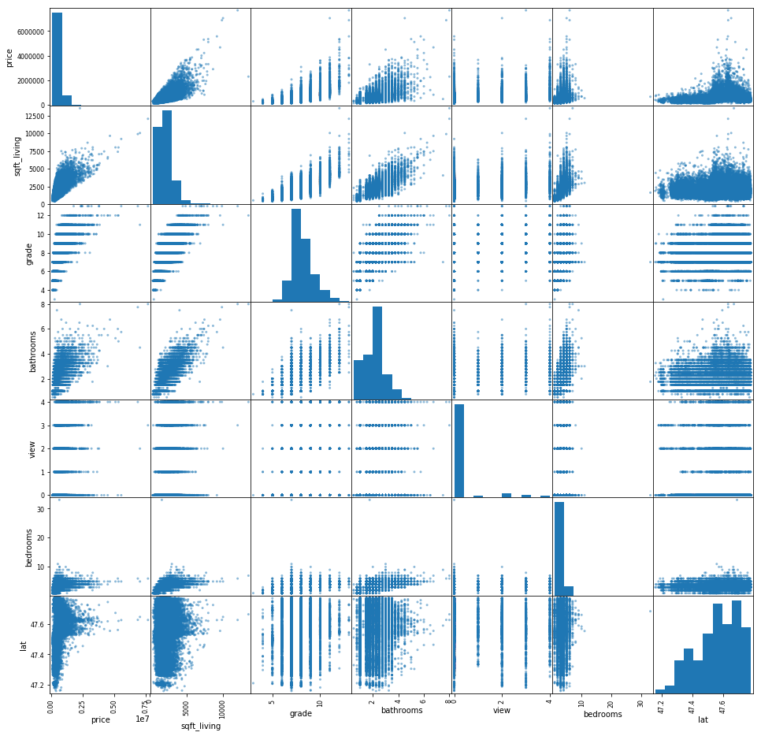


### Linearity of view seems problematic, removing view


```python
df_final_colums = ['price','sqft_living', 'grade','bathrooms','bedrooms','lat']
df_final = pd.DataFrame(df[df_final_colums])
model = get_model(df_final,'price')
model.summary()
```


<table class="simpletable">
<caption>OLS Regression Results</caption>
<tr>
  <th>Dep. Variable:</th>          <td>price</td>      <th>  R-squared:         </th>  <td>   0.603</td>  
</tr>
<tr>
  <th>Model:</th>                   <td>OLS</td>       <th>  Adj. R-squared:    </th>  <td>   0.603</td>  
</tr>
<tr>
  <th>Method:</th>             <td>Least Squares</td>  <th>  F-statistic:       </th>  <td>   6572.</td>  
</tr>
<tr>
  <th>Date:</th>             <td>Wed, 08 May 2019</td> <th>  Prob (F-statistic):</th>   <td>  0.00</td>   
</tr>
<tr>
  <th>Time:</th>                 <td>13:40:12</td>     <th>  Log-Likelihood:    </th> <td>-2.9740e+05</td>
</tr>
<tr>
  <th>No. Observations:</th>      <td> 21597</td>      <th>  AIC:               </th>  <td>5.948e+05</td> 
</tr>
<tr>
  <th>Df Residuals:</th>          <td> 21591</td>      <th>  BIC:               </th>  <td>5.949e+05</td> 
</tr>
<tr>
  <th>Df Model:</th>              <td>     5</td>      <th>                     </th>      <td> </td>     
</tr>
<tr>
  <th>Covariance Type:</th>      <td>nonrobust</td>    <th>                     </th>      <td> </td>     
</tr>
</table>
<table class="simpletable">
<tr>
       <td></td>          <th>coef</th>     <th>std err</th>      <th>t</th>      <th>P>|t|</th>  <th>[0.025</th>    <th>0.975]</th>  
</tr>
<tr>
  <th>const</th>       <td>-3.155e+07</td> <td> 5.44e+05</td> <td>  -57.965</td> <td> 0.000</td> <td>-3.26e+07</td> <td>-3.05e+07</td>
</tr>
<tr>
  <th>sqft_living</th> <td>  228.9736</td> <td>    3.348</td> <td>   68.384</td> <td> 0.000</td> <td>  222.411</td> <td>  235.537</td>
</tr>
<tr>
  <th>grade</th>       <td>  8.24e+04</td> <td> 2180.008</td> <td>   37.799</td> <td> 0.000</td> <td> 7.81e+04</td> <td> 8.67e+04</td>
</tr>
<tr>
  <th>bathrooms</th>   <td>-1.911e+04</td> <td> 3257.903</td> <td>   -5.865</td> <td> 0.000</td> <td>-2.55e+04</td> <td>-1.27e+04</td>
</tr>
<tr>
  <th>bedrooms</th>    <td>-3.684e+04</td> <td> 2148.165</td> <td>  -17.148</td> <td> 0.000</td> <td> -4.1e+04</td> <td>-3.26e+04</td>
</tr>
<tr>
  <th>lat</th>         <td> 6.549e+05</td> <td> 1.15e+04</td> <td>   57.100</td> <td> 0.000</td> <td> 6.32e+05</td> <td> 6.77e+05</td>
</tr>
</table>
<table class="simpletable">
<tr>
  <th>Omnibus:</th>       <td>18749.918</td> <th>  Durbin-Watson:     </th>  <td>   1.989</td>  
</tr>
<tr>
  <th>Prob(Omnibus):</th>  <td> 0.000</td>   <th>  Jarque-Bera (JB):  </th> <td>1455990.513</td>
</tr>
<tr>
  <th>Skew:</th>           <td> 3.793</td>   <th>  Prob(JB):          </th>  <td>    0.00</td>  
</tr>
<tr>
  <th>Kurtosis:</th>       <td>42.502</td>   <th>  Cond. No.          </th>  <td>7.87e+05</td>  
</tr>
</table><br/><br/>Warnings:<br/>[1] Standard Errors assume that the covariance matrix of the errors is correctly specified.<br/>[2] The condition number is large, 7.87e+05. This might indicate that there are<br/>strong multicollinearity or other numerical problems.


#### Rechecking linearity


```python
pd.plotting.scatter_matrix(df_final,figsize  = [16, 16]);
```


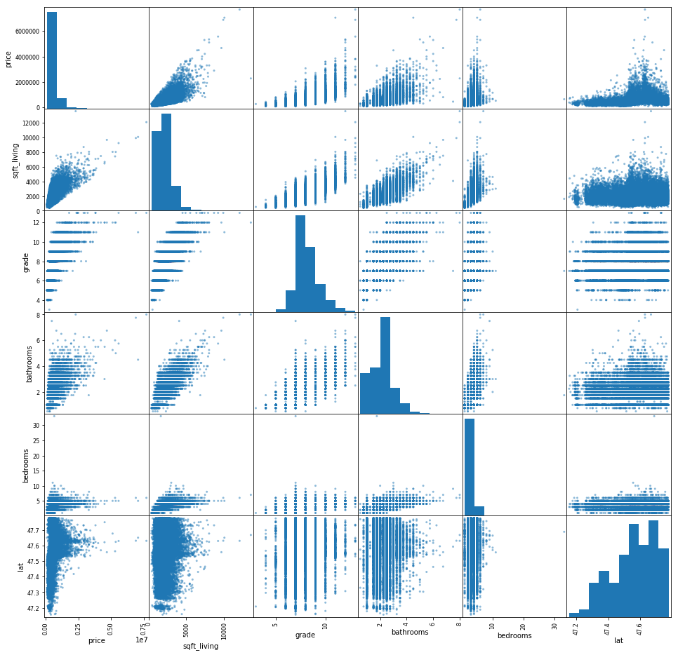


### Before:  Now let's try to improve the distribution of our top six correlated features


```python
for column in df_final:
    df[column].plot.hist(density=True, label = column+' histogram')
    df[column].plot.kde(label=column+' kde')
    plt.legend()
    plt.show()
```


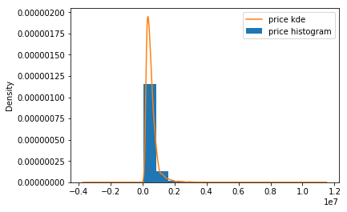


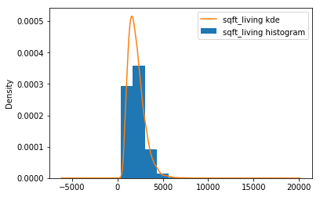


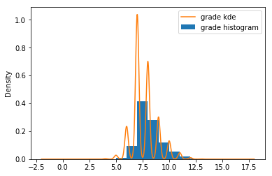


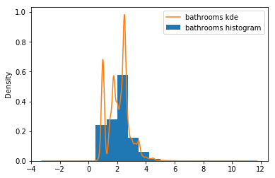


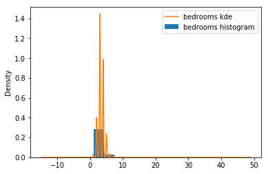


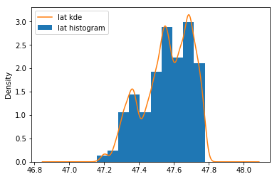


### After Logarithm Transformation
* Trying logorithm on price, sqft_living and bedrooms
* Seems wildly improved


```python
logprice = np.log(df_final['price'])
scaled_price = (logprice-np.mean(logprice))/np.sqrt(np.var(logprice))

logsqft_living = np.log(df_final['sqft_living'])
scaled_living = (logsqft_living-np.mean(logsqft_living))/np.sqrt(np.var(logsqft_living))

logbedrooms = np.log(df_final['bedrooms'])
scaled_bedrooms = (logbedrooms-np.mean(logbedrooms))/np.sqrt(np.var(logbedrooms))

df_final.price = scaled_price
df_final.bedrooms = scaled_bedrooms
df_final.sqft_living = scaled_living

```


```python
for column in df_final:
    df_final[column].plot.hist(density=True, label = column+' histogram')
    df_final[column].plot.kde(label=column+' kde')
    plt.legend()
    plt.show()
```


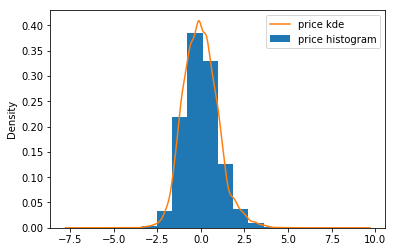


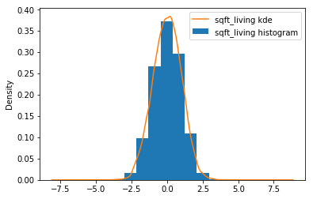


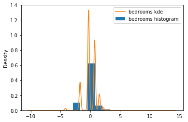


### How is it?
* Looks good for price and sqft_living
* small improvements on the others


```python
model = get_model(df_final,'price')
model.summary()
```


<table class="simpletable">
<caption>OLS Regression Results</caption>
<tr>
  <th>Dep. Variable:</th>          <td>price</td>      <th>  R-squared:         </th> <td>   0.700</td> 
</tr>
<tr>
  <th>Model:</th>                   <td>OLS</td>       <th>  Adj. R-squared:    </th> <td>   0.699</td> 
</tr>
<tr>
  <th>Method:</th>             <td>Least Squares</td>  <th>  F-statistic:       </th> <td>1.005e+04</td>
</tr>
<tr>
  <th>Date:</th>             <td>Wed, 08 May 2019</td> <th>  Prob (F-statistic):</th>  <td>  0.00</td>  
</tr>
<tr>
  <th>Time:</th>                 <td>13:40:54</td>     <th>  Log-Likelihood:    </th> <td> -17661.</td> 
</tr>
<tr>
  <th>No. Observations:</th>      <td> 21597</td>      <th>  AIC:               </th> <td>3.533e+04</td>
</tr>
<tr>
  <th>Df Residuals:</th>          <td> 21591</td>      <th>  BIC:               </th> <td>3.538e+04</td>
</tr>
<tr>
  <th>Df Model:</th>              <td>     5</td>      <th>                     </th>     <td> </td>    
</tr>
<tr>
  <th>Covariance Type:</th>      <td>nonrobust</td>    <th>                     </th>     <td> </td>    
</tr>
</table>
<table class="simpletable">
<tr>
       <td></td>          <th>coef</th>     <th>std err</th>      <th>t</th>      <th>P>|t|</th>  <th>[0.025</th>    <th>0.975]</th>  
</tr>
<tr>
  <th>const</th>       <td> -136.0337</td> <td>    1.290</td> <td> -105.413</td> <td> 0.000</td> <td> -138.563</td> <td> -133.504</td>
</tr>
<tr>
  <th>sqft_living</th> <td>    0.4252</td> <td>    0.008</td> <td>   56.170</td> <td> 0.000</td> <td>    0.410</td> <td>    0.440</td>
</tr>
<tr>
  <th>grade</th>       <td>    0.3072</td> <td>    0.005</td> <td>   60.960</td> <td> 0.000</td> <td>    0.297</td> <td>    0.317</td>
</tr>
<tr>
  <th>bathrooms</th>   <td>    0.0160</td> <td>    0.008</td> <td>    2.060</td> <td> 0.039</td> <td>    0.001</td> <td>    0.031</td>
</tr>
<tr>
  <th>bedrooms</th>    <td>   -0.0659</td> <td>    0.005</td> <td>  -13.082</td> <td> 0.000</td> <td>   -0.076</td> <td>   -0.056</td>
</tr>
<tr>
  <th>lat</th>         <td>    2.8101</td> <td>    0.027</td> <td>  103.281</td> <td> 0.000</td> <td>    2.757</td> <td>    2.863</td>
</tr>
</table>
<table class="simpletable">
<tr>
  <th>Omnibus:</th>       <td>888.203</td> <th>  Durbin-Watson:     </th> <td>   1.993</td> 
</tr>
<tr>
  <th>Prob(Omnibus):</th> <td> 0.000</td>  <th>  Jarque-Bera (JB):  </th> <td>1191.505</td> 
</tr>
<tr>
  <th>Skew:</th>          <td> 0.424</td>  <th>  Prob(JB):          </th> <td>1.85e-259</td>
</tr>
<tr>
  <th>Kurtosis:</th>      <td> 3.778</td>  <th>  Cond. No.          </th> <td>1.67e+04</td> 
</tr>
</table><br/><br/>Warnings:<br/>[1] Standard Errors assume that the covariance matrix of the errors is correctly specified.<br/>[2] The condition number is large, 1.67e+04. This might indicate that there are<br/>strong multicollinearity or other numerical problems.


### Note that the P-value of bathrooms is now elevated


```python
df_final.drop('bathrooms', axis=1, inplace=True)
```


```python
model = get_model(df_final,'price')
model.summary()
```


<table class="simpletable">
<caption>OLS Regression Results</caption>
<tr>
  <th>Dep. Variable:</th>          <td>price</td>      <th>  R-squared:         </th> <td>   0.699</td> 
</tr>
<tr>
  <th>Model:</th>                   <td>OLS</td>       <th>  Adj. R-squared:    </th> <td>   0.699</td> 
</tr>
<tr>
  <th>Method:</th>             <td>Least Squares</td>  <th>  F-statistic:       </th> <td>1.256e+04</td>
</tr>
<tr>
  <th>Date:</th>             <td>Wed, 08 May 2019</td> <th>  Prob (F-statistic):</th>  <td>  0.00</td>  
</tr>
<tr>
  <th>Time:</th>                 <td>13:41:01</td>     <th>  Log-Likelihood:    </th> <td> -17664.</td> 
</tr>
<tr>
  <th>No. Observations:</th>      <td> 21597</td>      <th>  AIC:               </th> <td>3.534e+04</td>
</tr>
<tr>
  <th>Df Residuals:</th>          <td> 21592</td>      <th>  BIC:               </th> <td>3.538e+04</td>
</tr>
<tr>
  <th>Df Model:</th>              <td>     4</td>      <th>                     </th>     <td> </td>    
</tr>
<tr>
  <th>Covariance Type:</th>      <td>nonrobust</td>    <th>                     </th>     <td> </td>    
</tr>
</table>
<table class="simpletable">
<tr>
       <td></td>          <th>coef</th>     <th>std err</th>      <th>t</th>      <th>P>|t|</th>  <th>[0.025</th>    <th>0.975]</th>  
</tr>
<tr>
  <th>const</th>       <td> -135.9294</td> <td>    1.290</td> <td> -105.406</td> <td> 0.000</td> <td> -138.457</td> <td> -133.402</td>
</tr>
<tr>
  <th>sqft_living</th> <td>    0.4315</td> <td>    0.007</td> <td>   62.449</td> <td> 0.000</td> <td>    0.418</td> <td>    0.445</td>
</tr>
<tr>
  <th>grade</th>       <td>    0.3098</td> <td>    0.005</td> <td>   63.477</td> <td> 0.000</td> <td>    0.300</td> <td>    0.319</td>
</tr>
<tr>
  <th>bedrooms</th>    <td>   -0.0647</td> <td>    0.005</td> <td>  -12.932</td> <td> 0.000</td> <td>   -0.075</td> <td>   -0.055</td>
</tr>
<tr>
  <th>lat</th>         <td>    2.8082</td> <td>    0.027</td> <td>  103.263</td> <td> 0.000</td> <td>    2.755</td> <td>    2.861</td>
</tr>
</table>
<table class="simpletable">
<tr>
  <th>Omnibus:</th>       <td>882.954</td> <th>  Durbin-Watson:     </th> <td>   1.994</td> 
</tr>
<tr>
  <th>Prob(Omnibus):</th> <td> 0.000</td>  <th>  Jarque-Bera (JB):  </th> <td>1188.176</td> 
</tr>
<tr>
  <th>Skew:</th>          <td> 0.421</td>  <th>  Prob(JB):          </th> <td>9.79e-259</td>
</tr>
<tr>
  <th>Kurtosis:</th>      <td> 3.782</td>  <th>  Cond. No.          </th> <td>1.67e+04</td> 
</tr>
</table><br/><br/>Warnings:<br/>[1] Standard Errors assume that the covariance matrix of the errors is correctly specified.<br/>[2] The condition number is large, 1.67e+04. This might indicate that there are<br/>strong multicollinearity or other numerical problems.


```python
df_final.corr().sort_values(by=['price'], ascending=False)
```


<div>
<style scoped>
    .dataframe tbody tr th:only-of-type {
        vertical-align: middle;
    }

    .dataframe tbody tr th {
        vertical-align: top;
    }

    .dataframe thead th {
        text-align: right;
    }
</style>
<table border="1" class="dataframe">
  <thead>
    <tr style="text-align: right;">
      <th></th>
      <th>price</th>
      <th>sqft_living</th>
      <th>grade</th>
      <th>bedrooms</th>
      <th>lat</th>
    </tr>
  </thead>
  <tbody>
    <tr>
      <th>price</th>
      <td>1.000000</td>
      <td>0.674802</td>
      <td>0.703720</td>
      <td>0.342850</td>
      <td>0.448837</td>
    </tr>
    <tr>
      <th>grade</th>
      <td>0.703720</td>
      <td>0.743038</td>
      <td>1.000000</td>
      <td>0.380427</td>
      <td>0.113575</td>
    </tr>
    <tr>
      <th>sqft_living</th>
      <td>0.674802</td>
      <td>1.000000</td>
      <td>0.743038</td>
      <td>0.648121</td>
      <td>0.038820</td>
    </tr>
    <tr>
      <th>lat</th>
      <td>0.448837</td>
      <td>0.038820</td>
      <td>0.113575</td>
      <td>-0.026784</td>
      <td>1.000000</td>
    </tr>
    <tr>
      <th>bedrooms</th>
      <td>0.342850</td>
      <td>0.648121</td>
      <td>0.380427</td>
      <td>1.000000</td>
      <td>-0.026784</td>
    </tr>
  </tbody>
</table>
</div>


```python
# df_final.drop('bedrooms', axis=1, inplace=True)
```


```python
model = get_model(df_final,'price')
model.summary()
```


<table class="simpletable">
<caption>OLS Regression Results</caption>
<tr>
  <th>Dep. Variable:</th>          <td>price</td>      <th>  R-squared:         </th> <td>   0.699</td> 
</tr>
<tr>
  <th>Model:</th>                   <td>OLS</td>       <th>  Adj. R-squared:    </th> <td>   0.699</td> 
</tr>
<tr>
  <th>Method:</th>             <td>Least Squares</td>  <th>  F-statistic:       </th> <td>1.256e+04</td>
</tr>
<tr>
  <th>Date:</th>             <td>Wed, 08 May 2019</td> <th>  Prob (F-statistic):</th>  <td>  0.00</td>  
</tr>
<tr>
  <th>Time:</th>                 <td>13:41:04</td>     <th>  Log-Likelihood:    </th> <td> -17664.</td> 
</tr>
<tr>
  <th>No. Observations:</th>      <td> 21597</td>      <th>  AIC:               </th> <td>3.534e+04</td>
</tr>
<tr>
  <th>Df Residuals:</th>          <td> 21592</td>      <th>  BIC:               </th> <td>3.538e+04</td>
</tr>
<tr>
  <th>Df Model:</th>              <td>     4</td>      <th>                     </th>     <td> </td>    
</tr>
<tr>
  <th>Covariance Type:</th>      <td>nonrobust</td>    <th>                     </th>     <td> </td>    
</tr>
</table>
<table class="simpletable">
<tr>
       <td></td>          <th>coef</th>     <th>std err</th>      <th>t</th>      <th>P>|t|</th>  <th>[0.025</th>    <th>0.975]</th>  
</tr>
<tr>
  <th>const</th>       <td> -135.9294</td> <td>    1.290</td> <td> -105.406</td> <td> 0.000</td> <td> -138.457</td> <td> -133.402</td>
</tr>
<tr>
  <th>sqft_living</th> <td>    0.4315</td> <td>    0.007</td> <td>   62.449</td> <td> 0.000</td> <td>    0.418</td> <td>    0.445</td>
</tr>
<tr>
  <th>grade</th>       <td>    0.3098</td> <td>    0.005</td> <td>   63.477</td> <td> 0.000</td> <td>    0.300</td> <td>    0.319</td>
</tr>
<tr>
  <th>bedrooms</th>    <td>   -0.0647</td> <td>    0.005</td> <td>  -12.932</td> <td> 0.000</td> <td>   -0.075</td> <td>   -0.055</td>
</tr>
<tr>
  <th>lat</th>         <td>    2.8082</td> <td>    0.027</td> <td>  103.263</td> <td> 0.000</td> <td>    2.755</td> <td>    2.861</td>
</tr>
</table>
<table class="simpletable">
<tr>
  <th>Omnibus:</th>       <td>882.954</td> <th>  Durbin-Watson:     </th> <td>   1.994</td> 
</tr>
<tr>
  <th>Prob(Omnibus):</th> <td> 0.000</td>  <th>  Jarque-Bera (JB):  </th> <td>1188.176</td> 
</tr>
<tr>
  <th>Skew:</th>          <td> 0.421</td>  <th>  Prob(JB):          </th> <td>9.79e-259</td>
</tr>
<tr>
  <th>Kurtosis:</th>      <td> 3.782</td>  <th>  Cond. No.          </th> <td>1.67e+04</td> 
</tr>
</table><br/><br/>Warnings:<br/>[1] Standard Errors assume that the covariance matrix of the errors is correctly specified.<br/>[2] The condition number is large, 1.67e+04. This might indicate that there are<br/>strong multicollinearity or other numerical problems.


## Check the normality assumptions by creating a QQ-plots


```python
residuals = model.resid
fig = sm.graphics.qqplot(residuals, dist=stats.norm, line='45', fit=True)
fig.show()
```

    /Users/davidhaase/anaconda3/envs/learn-env/lib/python3.6/site-packages/matplotlib/figure.py:445: UserWarning: Matplotlib is currently using module://ipykernel.pylab.backend_inline, which is a non-GUI backend, so cannot show the figure.
      % get_backend())


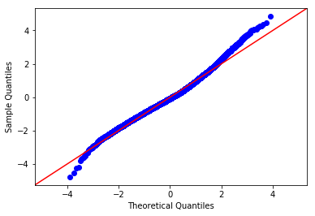


## Predictive Visualizations


```python
for feature in df_final.columns:
    show_predictions(feature)
```

          price
    0 -3.387659
    1  5.333889
    0   -3.387659
    1    5.333889
    dtype: float64


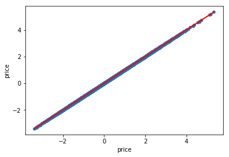


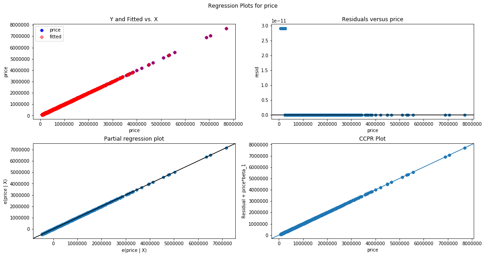


       sqft_living
    0    -3.859712
    1     4.626992
    0   -45072.942675
    1   -42689.341178
    dtype: float64


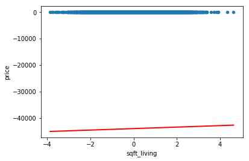


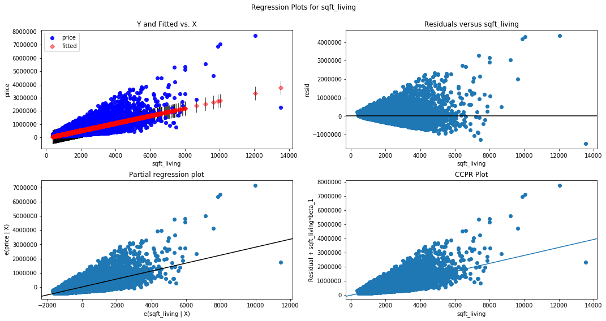


       grade
    0      3
    1     13
    0   -4.339427e+05
    1    1.657635e+06
    dtype: float64


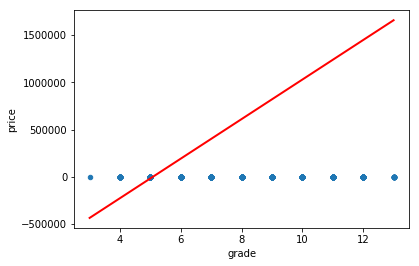


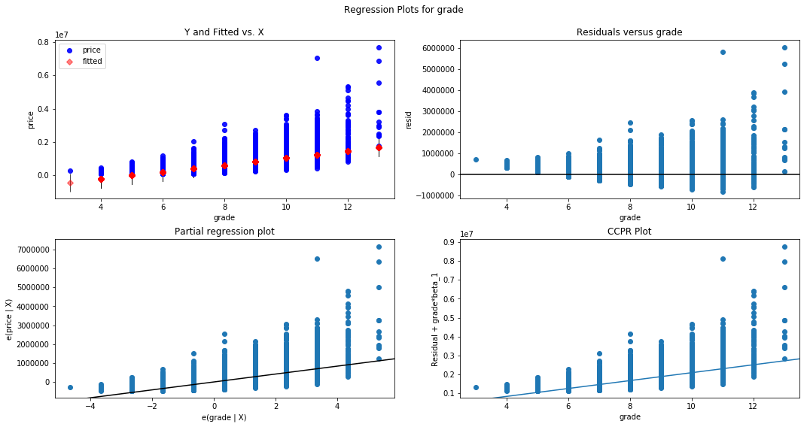


       bedrooms
    0 -4.159544
    1  8.188596
    0   -3.821968e+05
    1    1.130011e+06
    dtype: float64


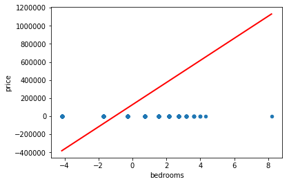


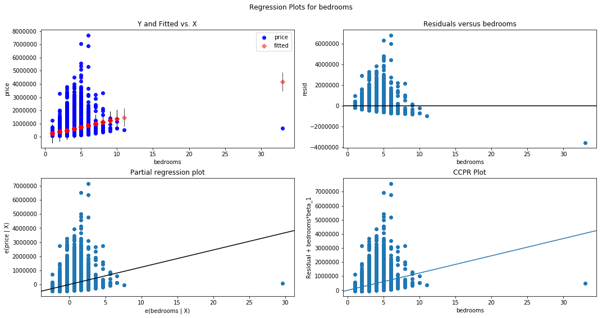


           lat
    0  47.1559
    1  47.7776
    0    211610.660283
    1    717171.209533
    dtype: float64


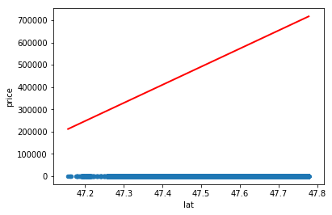


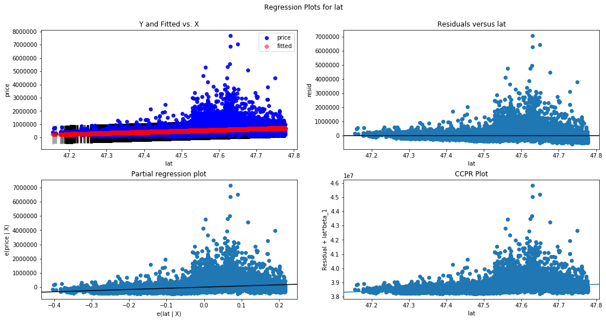


## Training
### Now split the data into 80/20 and check the error rates


```python
target = 'price'
y = df_final[[target]]
X = df_final.drop([target], axis=1)
```


```python
train_and_check_error(X,y,0.2)
```

    17277 4320 17277 4320
    Train Mean Squared Error: price    0.299888
    dtype: float64
    Test Mean Squared Error: price    0.303227
    dtype: float64
    Train Mean Squared Error: 0.29988840613119466
    Test Mean Squared Error: 0.30322696597389465


```python

```
